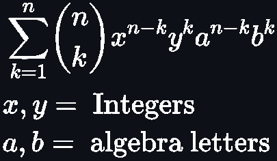

# Binomial Theorem

This program develops any powered binomial to his extended form.
It supports decimal value and negative input in the binomial. 'n' cannot be negative or decimal because of what the theorem says.

Binomial theorem (with multipliers added in) is defined by this formula I made:

# Limitations

- Exponent cannot be greater than 1030 due to large divisions in float numbers.
- Exponent cannot be very big if you introduce float numbers (decimal point) due the same reason.

# Motivations

Make a list of programs which makes you the homework without doing anything by your own, just with a little time writing code.

Before starting to code I used to study a lot of math and any other science topic by my own way. But I never found a really good way to apply that knowledge in neither my diary life nor future, so I started learning programming for that and it is incredible. I've been learning programming for 3 weeks on the date I upload this.

This program is made for learning purposes. If you think you can make it better, tiny, readable, etc and you do it, please let me know, this way I will learn more and I will thank you.
